# DINOv3 Experiments

A repo for running visualization experiments with DINOv3 (Vision Transformer) models. This project provides various experiments to analyze and visualize DINOv3 patch tokens, including feature length maps, PCA visualizations, patch similarity maps, and patch matching between images.

## Features

- **Features Length Experiment**: Compute normalized feature length maps from patch tokens
- **PCA Experiment**: Apply PCA dimensionality reduction to patch tokens for RGB visualization
- **Similarity Experiment**: Compute similarity maps between a selected patch (or CLS token) and all patches
- **Matching Experiment**: Find optimal patch matching between two images using linear assignment

## Examples

Some example outputs produced by the scripts in this repo:

### Features Length Visualization

<div>
  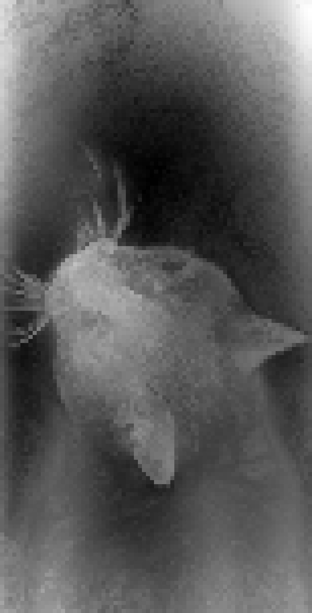
  
</div>

### PCA Visualization

<div>
  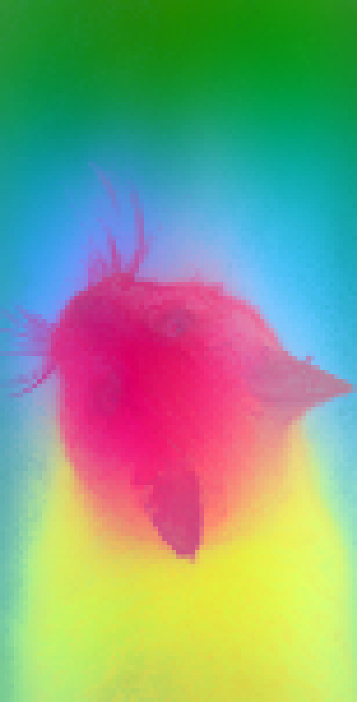
  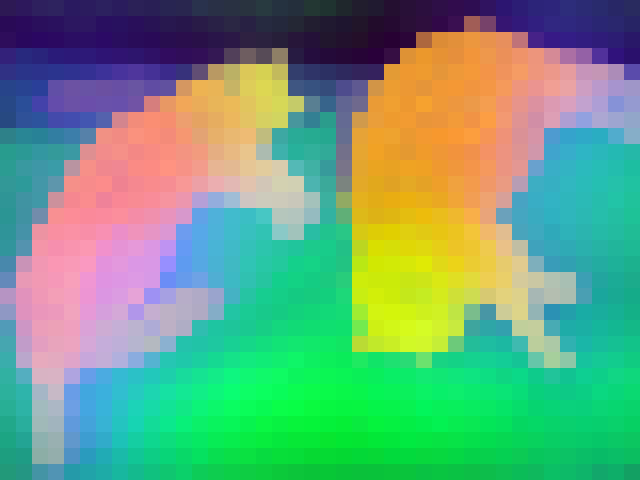
  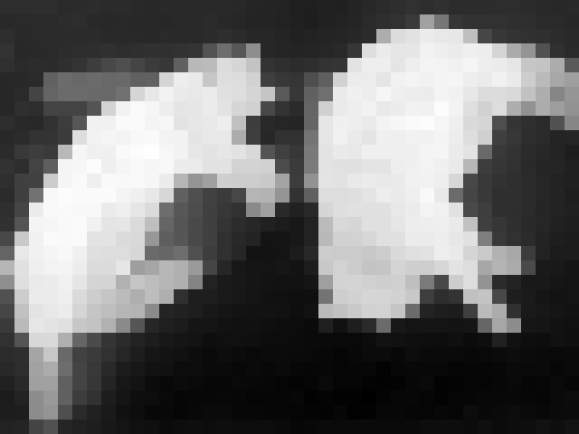
</div>

### Similarity Maps

<div>
  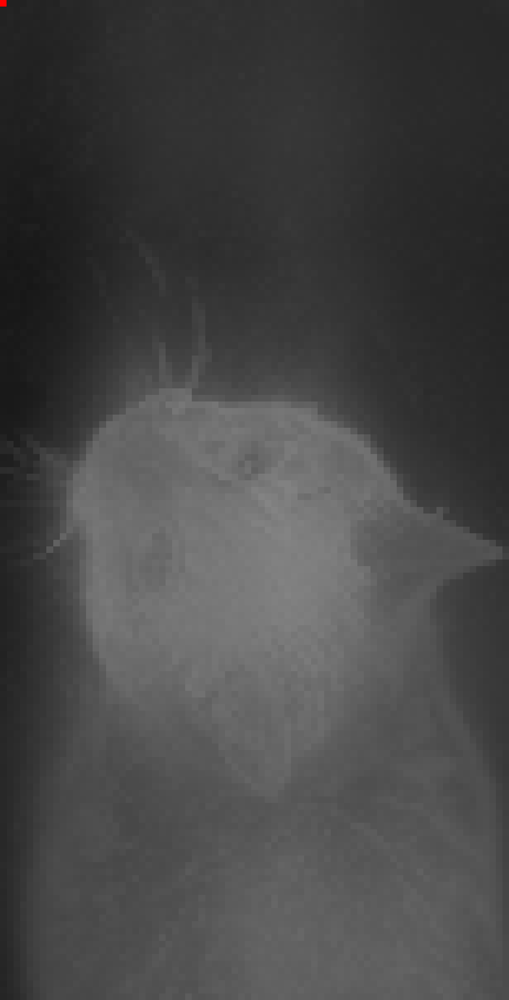
  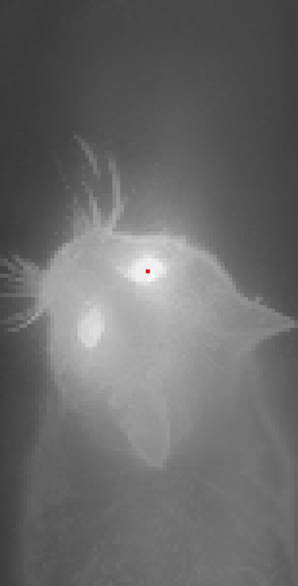
  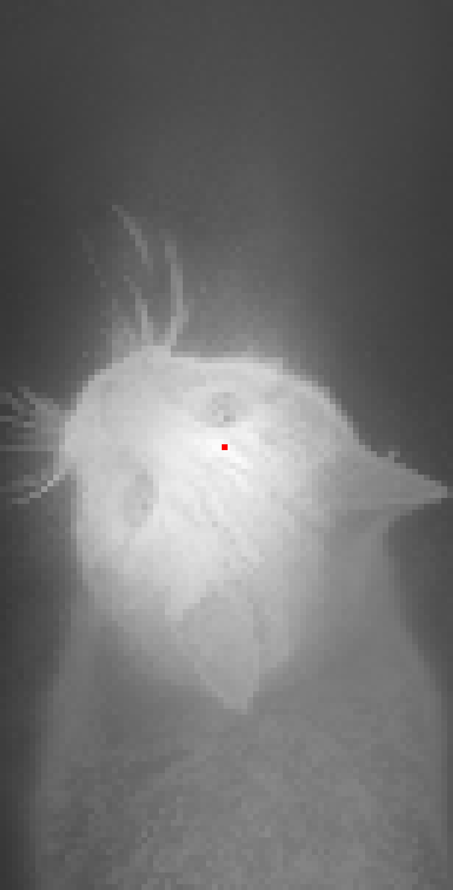
  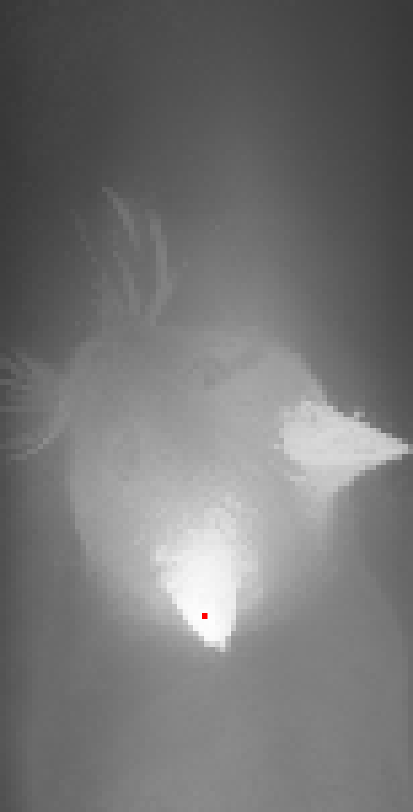
  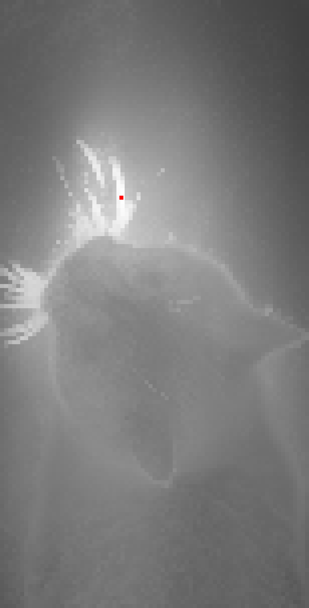
  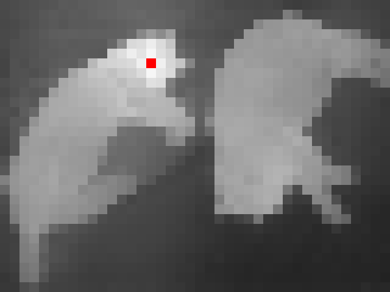
</div>

### Patch Matching

<div>
  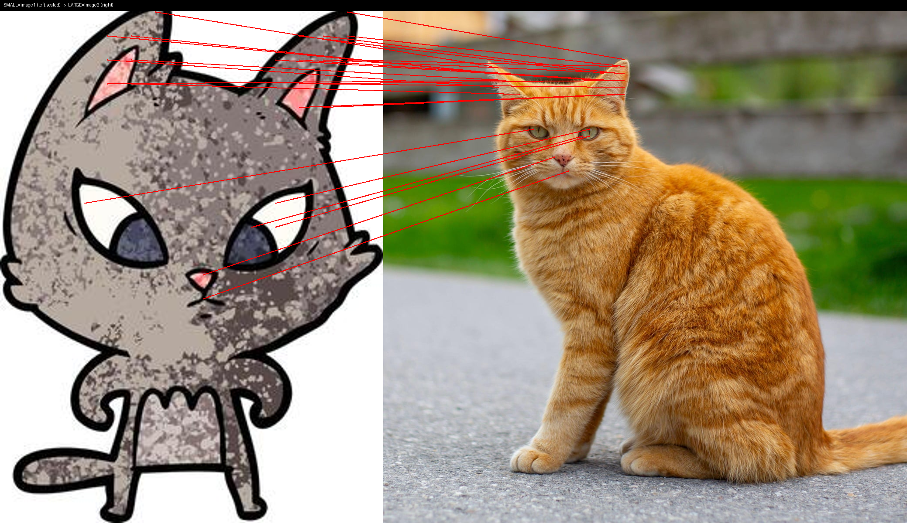
</div>

### Original Inputs

<div>
  
  
  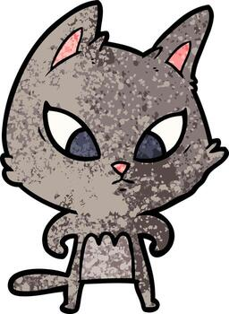
  
</div>

## Installation

1. Clone this repository:
```bash
git clone https://github.com/MrFishPL/DINOv3Experiments.git
cd DINOv3Experiments
```

2. Install dependencies:
```bash
pip install -r requirements.txt
```

### Requirements

- Python 3.10
- PyTorch
- transformers
- torchvision
- pillow
- accelerate
- torch-pca
- torch-linear-assignment

## Project Structure

```
DINO/
├── experiments/          # Experiment classes
│   ├── base_experiment.py
│   ├── features_length.py
│   ├── matching.py
│   ├── pca.py
│   └── similarity.py
├── scripts/              # Command-line scripts
│   ├── run_feat_len.py
│   ├── run_matching.py
│   ├── run_pca.py
│   └── run_similarity.py
├── utils/                # Utility functions
│   ├── image_utils.py
│   ├── model_utils.py
│   └── visualization_utils.py
└── requirements.txt
```

## Usage

### Features Length Visualization

Compute and visualize normalized feature length maps:

```bash
python -m scripts.run_feat_len --input_path <image_path> --output_dir outputs --device cuda
```

**Options:**
- `--input_path`: Path or URL to input image (default: COCO dataset sample)
- `--output_dir`: Directory to save output (default: `outputs`)
- `--device`: Device to use - `cuda`, `mps`, or `cpu` (default: `cuda`)

**Output:** `norm_feat_lens.png` - Grayscale heatmap of normalized feature lengths

### PCA Visualization

Apply PCA to patch tokens and visualize as RGB image:

```bash
python -m scripts.run_pca --input_path <image_path> --output_dir outputs --device cuda
```

**Options:**
- `--input_path`: Path or URL to input image (default: COCO dataset sample)
- `--output_dir`: Directory to save output (default: `outputs`)
- `--device`: Device to use - `cuda`, `mps`, or `cpu` (default: `cuda`)

**Output:** `pca.png` - RGB visualization of PCA components

### Similarity Map Visualization

Compute similarity map between a selected patch and all patches:

```bash
python -m scripts.run_similarity --input_path <image_path> --patch_idx 0 --output_dir outputs --device cuda
```

**Options:**
- `--input_path`: Path or URL to input image (default: COCO dataset sample)
- `--patch_idx`: Index of patch to compare (use `-1` for CLS token) (required)
- `--output_dir`: Directory to save output (default: `outputs`)
- `--device`: Device to use - `cuda`, `mps`, or `cpu` (default: `cuda`)

**Output:** `similarity.png` - Similarity heatmap with selected patch highlighted in red

### Patch Matching Visualization

Visualize optimal patch matching between two images:

```bash
python -m scripts.run_matching --input_path1 <image1> --input_path2 <image2> --output_dir outputs --device cuda
```

**Options:**
- `--input_path1`: Path or URL to first image (default: sample image)
- `--input_path2`: Path or URL to second image (default: sample image)
- `--output_dir`: Directory to save output (default: `outputs`)
- `--out_name`: Output filename (default: `matching_vis.png`)
- `--device`: Device to use - `cuda`, `mps`, or `cpu` (default: `cuda`)
- `--max_lines`: Maximum number of matching lines to draw (default: 800)
- `--top_k`: Draw only top K matches by score (0 = use all or max_lines) (default: 0)
- `--seed`: Random seed for sampling patches (default: 0)

**Output:** `matching_vis.png` - Side-by-side visualization with matching lines

## API Usage

You can also use the experiments programmatically:

```python
from experiments import FeaturesLengthExperiment
from utils import load_dinov3_model, process_image

# Load model and process image
model = load_dinov3_model(device="cuda")
image, inputs = process_image("path/to/image.jpg", device="cuda")

# Create and run experiment
experiment = FeaturesLengthExperiment(dinov3_model=model, device="cuda")
outputs = experiment.run_dict(inputs)
norm_feat_lens = outputs["norm_feat_lens"]
```

## Model

This project uses the DINOv3 ViT-B/16 model pretrained on LVD-1689M:
- Model: `facebook/dinov3-vitb16-pretrain-lvd1689m`
- Patch size: 16x16
- Attention implementation: Eager (for accesing attention values in the future experiments)

The model is automatically downloaded from Hugging Face on first use. You have to be logged in - the model requires access to be granted.

## Experiments Overview

### FeaturesLengthExperiment

Computes the vector norm (L2 norm) of each patch token and normalizes the values to [0, 1] range for visualization. This helps identify patches with high feature magnitudes.

### PCAExperiment

Applies Principal Component Analysis to reduce patch token dimensions to 3 components, which are then visualized as RGB channels. This provides a colorful visualization of the patch feature space.

### SimilarityExperiment

Computes cosine similarity between a selected patch (or the CLS token) and all other patches in the image. Useful for finding similar regions or understanding patch relationships.

### MatchingExperiment

Uses linear assignment (Hungarian algorithm) to find optimal patch-to-patch matching between two images based on cosine similarity. The smaller image's patches are matched to the larger image's patches.

## Notes

- All experiments work with images of any size (no resizing by default)
- The model processes images in patches of 16x16 pixels
- GPU acceleration is recommended for faster processing
- The matching experiment requires the first image to have fewer or equal patches than the second image

---

```
@misc{simeoni2025dinov3,
  title={{DINOv3}},
  author={Sim{\'e}oni, Oriane and Vo, Huy V. and Seitzer, Maximilian and Baldassarre, Federico and Oquab, Maxime and Jose, Cijo and Khalidov, Vasil and Szafraniec, Marc and Yi, Seungeun and Ramamonjisoa, Micha{\"e}l and Massa, Francisco and Haziza, Daniel and Wehrstedt, Luca and Wang, Jianyuan and Darcet, Timoth{\'e}e and Moutakanni, Th{\'e}o and Sentana, Leonel and Roberts, Claire and Vedaldi, Andrea and Tolan, Jamie and Brandt, John and Couprie, Camille and Mairal, Julien and J{\'e}gou, Herv{\'e} and Labatut, Patrick and Bojanowski, Piotr},
  year={2025},
  eprint={2508.10104},
  archivePrefix={arXiv},
  primaryClass={cs.CV},
  url={https://arxiv.org/abs/2508.10104},
}
```
